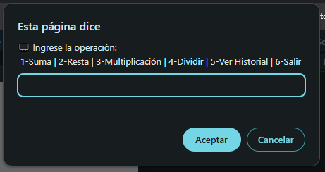
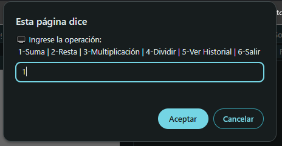
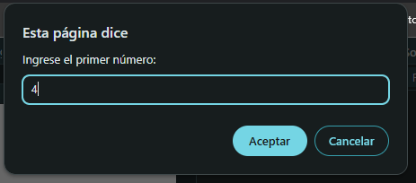
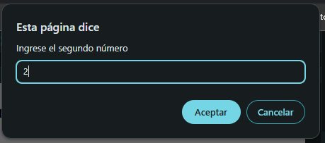
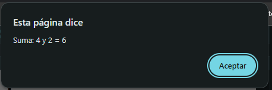
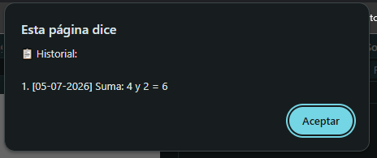
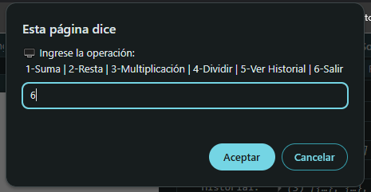
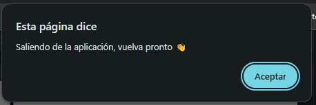
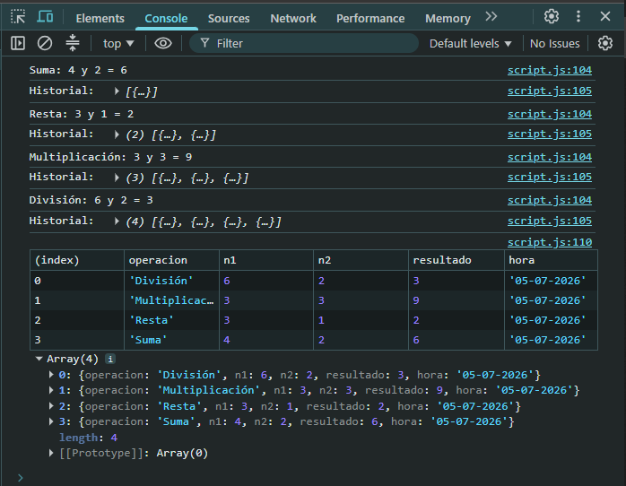

# 💼 Proyecto Aplicación de Consola

Una aplicación de consola simple, que permite a los usuarios realizar operaciones mátematicas básicas, como suma, resta

El proyecto fue realizado con **HTML** y **JavaScript**.

---

## 📁 Estructura del proyecto

```
App-Consola/
│
├── index.html          # Archivo de ingreso de la App
├── script.js           # Script con la lógica del proyecto
│
└── README.md           # Documentación y demo del proyecto
```

---

## 🖥️ Funcionalidades

### 1. Funciones flecha que definen las operaciones matemáticas

```javascript
// Funciones flecha que definen las operaciones matemáticas
const sumar = (a, b) => a + b;
const restar = (a, b) => a - b;
const multiplicar = (a, b) => a * b;
const dividir = (a, b) => a / b;
```

### 2. Solicitar y validar número ingresado

```javascript
// Función que solicita y valida los números ingresados
const solicitarValidarNumero = (mensaje) => {
  while (true) {
    let input = prompt(mensaje);
    if (input === null) return null;
    input = input.trim();
    if (input === "") {
      alert("El campo no puede estar vacío");
      continue;
    }
    const numero = Number(input);
    if (isNaN(numero)) {
      alert("Ingresa un número válido");
      continue;
    }
    return numero;
  }
};
```

### 3. Mostrar el historial

```javascript
// Función para mostrar el historial de la aplicación
const mostrarHistorial = () => {
  if (historial.length === 0) {
    alert("No hay operaciones en el historial.");
    return;
  }

  const historialImpreso = historial.map((r, i) => `${i + 1}. [${r.hora}] ${r.operacion}: ${r.n1} y ${r.n2} = ${r.resultado}`).join("\n");

  alert("📋 Historial:\n\n" + historialImpreso);
};
```

### 4. Bucle Do While

```javascript
do {
  let operacion = prompt("🖥 Ingrese la operación: \n 1-Suma | 2-Resta | 3-Multiplicación | 4-Dividir | 5-Ver Historial | 6-Salir");

  if (operacion === null || operacion === "6") {
    exit = false;
    break;
  }

  if (operacion === "5") {
    mostrarHistorial();
    continue;
  }

  if (!opciones.includes(operacion)) {
    alert("Opción no válida. Ingrese un número del 1 al 6");
    continue;
  }

  let n1 = solicitarValidarNumero("Ingrese el primer número: ");
  if (n1 === null) break;
  let n2 = solicitarValidarNumero("Ingrese el segundo número");
  if (n2 === null) break;

  if (operacion === "4" && n2 === 0) {
    alert("No se puede dividir por cero");
    continue;
  }

  // Estructura condicional y Objeto registro de las operaciones
} while (exit);
```

### 5. Estructura condicional

```javascript
// Estructura condicional para la operación seleccionada
switch (operacion) {
  case "1":
    resultado = sumar(n1, n2);
    nombreOperacion = "Suma";
    break;
  case "2":
    resultado = restar(n1, n2);
    nombreOperacion = "Resta";
    break;
  case "3":
    resultado = multiplicar(n1, n2);
    nombreOperacion = "Multiplicación";
    break;
  case "4":
    resultado = dividir(n1, n2);
    nombreOperacion = "División";
    break;
}
```

### 5. Objeto registro

```javascript
// Objeto litera para llevar un registro de las operaciones
const registro = {
  operacion: nombreOperacion,
  n1,
  n2,
  resultado,
  hora: new Date().toLocaleDateString(),
};
```

---

## 💻 Instalación y uso

1. **Clonar o descargar** el repositorio:

```bash
   git clone https://github.com/VictorOlea/App-Consola
```

2. **Abrir** el archivo `index.html` en el navegador.

3. **Abrir herramientas de desarrolador**

4. Inicio de aplicación



3. Seleccione una de las opciones:



5. Ingrese primer número:



5. Ingrese segundo número



6. Resultado de la operación:



7. Seleccione historial



8. Salir de la aplicación con la opción **6**





9. En **Dev Tools** se mostrará las operaciones realizadas y el historial en formato de tabla



---

## 👤 Autor

Desarrollado como proyecto práctico para el modúlo 3 **Fundamentos de programación JavaScript**.

---

## 📄 Licencia

Este proyecto es de uso educativo y no tiene fines comerciales.
